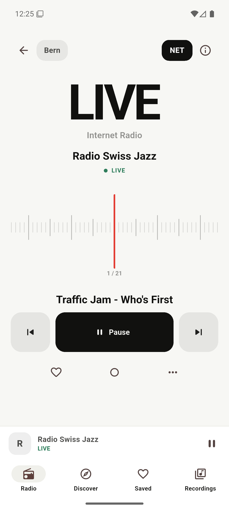
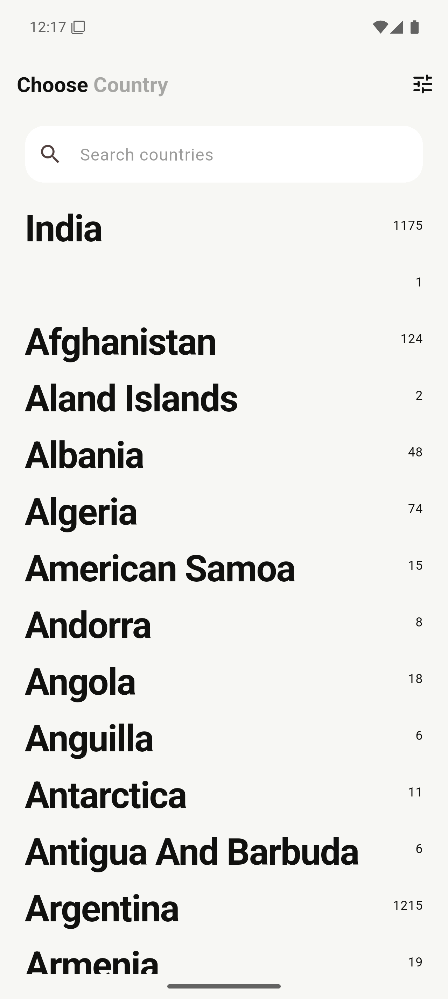
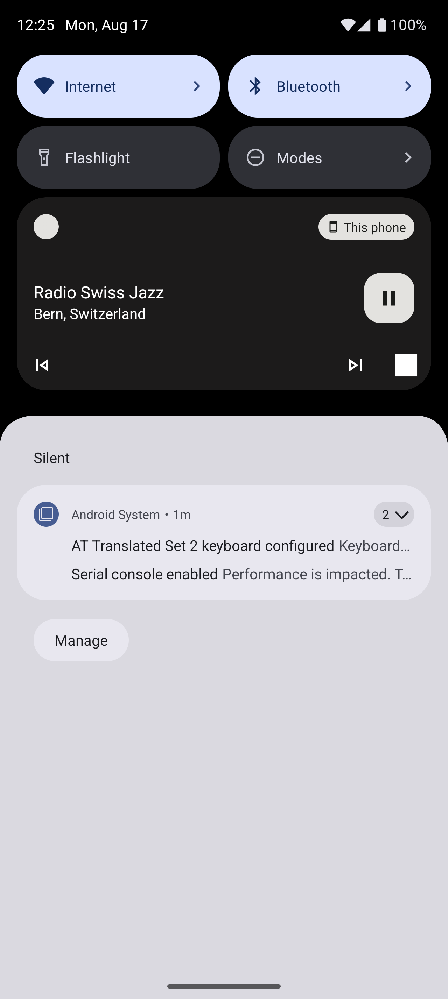
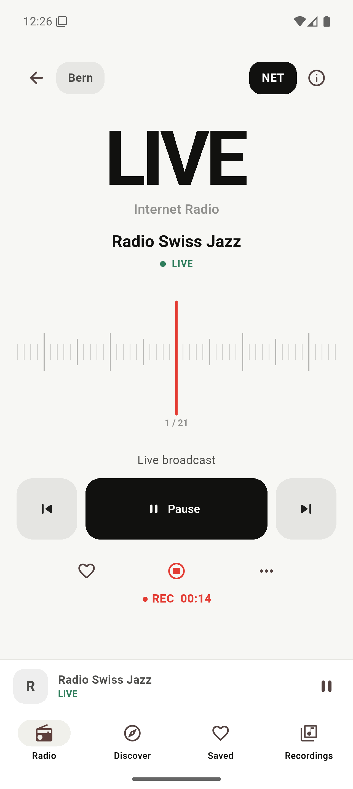
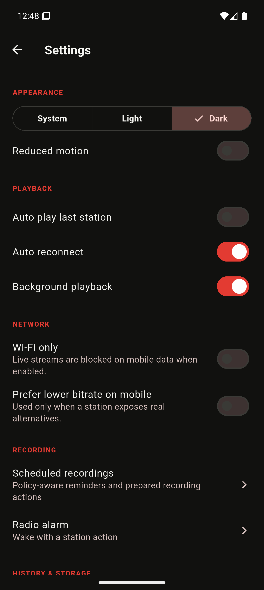

# Dhwani

**Dhwani — Live Radio** is a privacy-first Flutter radio app for listening to real stations from home and around the world. Its first-run journey begins with India → Bihar → Darbhanga and treats **Akashvani Darbhanga, 1296 kHz MW/AM** as a first-class station without pretending that a distant terrestrial frequency is directly receivable by a phone.



## What works

- Country, state, and city browsing backed by cached Radio Browser data and an India-specific Akashvani source.
- Cache-first, debounced global search across station, country, state, city, language, tags, frequency, and band, with recent-search management and remote result merging.
- One central live player with MP3/AAC/HLS support through platform decoders, truthful connection states, stream failover, ICY metadata, next/previous queues, AM/FM/NET filtering, volume, sleep timer, and a draggable/snapping custom tuner.
- Android background audio with media notification, lock-screen/Bluetooth/headset play, pause, previous, next, stop, audio focus, interruption handling, and noisy-output pause.
- Searchable/reorderable favourites, optional collections, listening duration/play counts, custom stations, durable source health, last-station restoration, and structured Drift/SQLite persistence.
- Network-stream recording with stream copy, timer, FFprobe validation, playback, rename, details, sharing, Android Storage Access Framework export, and deletion. Dhwani never requests microphone permission.
- Recordings library with seek, storage totals, original/MP3/M4A output choices, light/dark/system appearance, reduced motion, Android equalizer presets/custom bands, Wi-Fi-only playback, real-alternative bitrate preference, local JSON backup/import, Car Mode, persistent fade-out sleep timing, and selected-weekday alarm/recording reminders.
- Offline opening of cached catalogue, favourites, history, custom RF metadata, and local recordings. Live controls explain when a network stream is unavailable.

## Screenshots

| Browse | Player | Background | Recording | Dark mode |
| --- | --- | --- | --- | --- |
|  |  |  |  |  |

Additional inspected screenshots live in `artifacts/screenshots/`, including the splash, state/city flow, Darbhanga list, player states, SAF export, 1.3× text scaling, dark mode, compact-phone and tablet layouts.

## Architecture

The codebase is feature-oriented without adding ceremonial layers:

```text
lib/
├── app/                 # root app, GoRouter, Riverpod providers, themes
├── core/
│   ├── audio/           # just_audio + audio_service playback authority
│   ├── notifications/   # policy-aware reminder scheduling
│   ├── persistence/     # Drift database and generated schema
│   ├── platform/        # SAF/share platform bridge
│   ├── recording/       # FFmpeg stream recording and validation
│   └── settings/
├── data/
│   ├── datasources/     # Radio Browser and Akashvani
│   ├── models/
│   └── repositories/    # merged cached catalogue
└── features/            # location, discover, search, player, saved,
                         # custom stations, recordings, car mode, settings
```

Riverpod owns dependency/state boundaries, GoRouter owns navigation, Drift stores structured user/catalogue data, SharedPreferences stores only small settings, and Dio handles bounded network access.

## Data sources

### Radio Browser

Dhwani follows the directory's mirror-discovery strategy instead of pinning one host. It discovers HTTPS servers, ranks and rotates them, sends a descriptive user agent, bounds requests, retries only safe requests, caches results, and fails over when a mirror fails. Station clicks are registered only when playback is requested.

Directory: <https://www.radio-browser.info/>

API documentation: <https://docs.radio-browser.info/>

### Akashvani

The India source uses public Akashvani discovery metadata and refreshes Darbhanga playback from the official live page when available. Prasar Bharati's East Zone service document is the authority for the terrestrial **1296 kHz** value.

- Official live page: <https://akashvani.gov.in/radio/live.php>
- Public discovery feed: <https://raw.githubusercontent.com/codito/akashvani/master/stations.json>
- Prasar Bharati service document: <https://prasarbharati.gov.in/wp-content/uploads/2025/03/East-Zone-Region-Services-22082024.pdf>

Upstream station URLs are not treated as permanent. Dhwani keeps ranked alternatives and reports failures instead of showing a false LIVE state.

## Frequency and live playback

`1296 kHz · Medium Wave` is terrestrial metadata. Playback requires a separate internet URL. Internet-only stations display `LIVE · Internet Radio`; Dhwani does not invent FM numbers to decorate the tuner. The domain model is already extensible across `internetStream`, `remoteRfReceiver`, and `localRecording` sources.

`DhwaniAudioHandler` is the only playback authority. It ranks known working URLs, applies a 15-second startup bound per source, tries alternatives without infinite retry, publishes observable idle/loading/buffering/playing/paused/reconnecting/error states, and maps them into the Android media session.

## Background audio

Android uses a typed `mediaPlayback` foreground service through `audio_service`. The manifest includes the media service and media-button receiver required for notification, lock-screen, wired-headset, and Bluetooth controls. `audio_session` requests music focus and handles interruptions plus becoming-noisy events.

## Recording and licensing

Recording captures the **network stream**, not the microphone. `ffmpeg_kit_flutter_new_full` 2.5.2 provides the maintained non-GPL FFmpeg 8.1.2 bundle with TLS and audio codecs under LGPL-3.0. Device testing rejected the smaller audio-only variant because its native binary lacked HTTPS protocol support; the original retired FFmpegKit and GPL builds are also rejected. Dhwani requests stream copy (`-c copy`) where the source permits it, stops only its owned session, and accepts a recording only after a non-empty file and FFprobe duration/format check.

Native FFmpeg libraries make the universal APK large. The AAB lets Google Play deliver ABI-specific splits. Full research and trade-offs are in [research.md](research.md) and [decision.md](decision.md).

## Pixel 10 / modern Android

- Application ID: `com.prashant.dhwani`
- Minimum SDK: 24
- Compile/target SDK: 36 (Android 16)
- Edge-to-edge status/navigation bars, predictive-back-compatible routing, scoped storage, contextual Android 13+ notification permission, and typed media foreground service.
- Verified on three Android 16/API 36 profiles: `Dhwani_Compact_API36` (720×1280, 320 dpi), `Dhwani_Pixel_10_Approx` (1280×2856, 480 dpi), and `Dhwani_Tablet_API36` (2560×1600, 320 dpi). A physical Pixel 10 was not connected, so the Pixel profile remains an explicit approximation in [test_report.md](test_report.md).

## Android permissions

The Android build uses internet/network-state access, wake lock, media playback foreground service, and notification permission when the user schedules reminders. It does **not** request microphone, location, contacts, account, broad media, or legacy external-storage permissions.

## Setup

Requirements used for the verified build:

- Flutter 3.41.9 stable / Dart 3.11.5
- Java 21
- Android SDK 36

```powershell
flutter pub get
dart run build_runner build --delete-conflicting-outputs
dart run flutter_launcher_icons
dart run flutter_native_splash:create
flutter run -d emulator-5554
```

## Tests

```powershell
dart format .
flutter analyze
flutter test
flutter test integration_test/onboarding_flow_test.dart -d emulator-5554
flutter test integration_test/custom_station_flow_test.dart -d emulator-5554
flutter test integration_test/onboarding_flow_test.dart -d emulator-5556
flutter test integration_test/onboarding_flow_test.dart -d emulator-5558
```

The automated suite covers domain parsing and stream ranking, deterministic directory mirror failover/malformed data, terrestrial band parsing, tuning queue widening/sorting, favourite order, history metrics, collections, stream health, custom persistence, constrained backup import, recording filenames, search/sort/settings widgets, branding semantics, onboarding navigation, and custom-station creation/reopening. Live audio, Android media session, foreground notification controls, recording, playback, and SAF export were additionally exercised on-device; see [test_report.md](test_report.md).

## Build

```powershell
flutter build apk --debug
flutter build apk --release
flutter build appbundle --release
flutter build windows
```

Outputs:

- `build/app/outputs/flutter-apk/app-debug.apk`
- `build/app/outputs/flutter-apk/app-release.apk`
- `build/app/outputs/bundle/release/app-release.aab`
- `build/windows/x64/runner/Release/dhwani.exe`

The local release artifacts use the Android debug certificate because no private release keystore was supplied. Generate and protect a real upload key before a Play/GitHub production release; never commit the keystore or passwords.

## Privacy

Dhwani has no account, ads, analytics, telemetry, or tracking SDK. Favourites, history, searches, custom stations, and recordings remain local. Backups and recordings leave the device only when the user explicitly exports or shares them.

## Known limitations

See [known_issues.md](known_issues.md). The most important current limitation is upstream: Akashvani Darbhanga's official stream endpoint reset TLS from the German test network while its older CDN URL returned 404. The station metadata remains available and the UI reports the stream as unavailable; the player was independently proven with Radio Swiss Jazz.

## Future: Dadaji receiver

The model includes `remoteRfReceiver` for a future receiver physically located around Darbhanga:

```text
AM/FM antenna → receiver/Raspberry Pi → private internet audio endpoint → Dhwani
```

That is the technically honest way to hear the actual village RF signal abroad. No RF hardware is part of this release.
